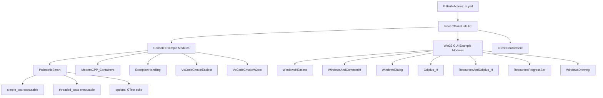

# Enterprise Readiness Baseline (2026-07-31)

## Scope and Method

This assessment is based on direct inspection of the repository source code, CMake files, CI workflow, and documentation.

- Source modules inspected: all 12 example modules in repository root
- Build system inspected: root `CMakeLists.txt` plus all module `CMakeLists.txt`
- CI/CD inspected: `.github/workflows/ci.yml`
- Governance/docs inspected: `README.md`, `CONTRIBUTING.md`, `SECURITY.md`, `docs/RELEASE_CHECKLIST.md`
- Validation executed:
  - `cmake -S PolimorficSmart -B build_agent_ps -DBUILD_TESTING=ON`
  - `cmake --build build_agent_ps --config Debug`
  - `ctest --test-dir build_agent_ps -C Debug --output-on-failure`
  - `cmake -S . -B build_agent_root -DBUILD_TESTING=ON`
  - `cmake --build build_agent_root --config Debug`
  - `ctest --test-dir build_agent_root -C Debug --output-on-failure`

All listed commands completed successfully in this workspace with 7 discovered/passing tests.

---

## Phase 1 - Repository Discovery

### System Inventory

- Product type: Educational C++ example suite (console + Win32 desktop).
- Build system: CMake 3.14 baseline across root and modules.
- Primary language standards:
  - C++17: `PolimorficSmart`, `ModernCPP_Containers`, `ExceptionHandling`
  - C++11: remaining modules
- Runtime surfaces:
  - Console apps: `VsCodeCmakeEasiest`, `VsCodeCmakeW2src`, `ModernCPP_Containers`, `ExceptionHandling`, `PolimorficSmart`
  - Win32 GUI apps: `WindowsHEasiest`, `WindowsAndCommctrlH`, `WindowsDialog`, `Gdiplus_H`, `ResourcesAndGdiplus_H`, `ResourcesProgressBar`, `WindowsDrawing`
- Persistence layer: none (no DB/files used as system state except demo `grades.txt` in `ModernCPP_Containers`).
- Network/API layer: none (no HTTP services or external API contracts).
- Infrastructure-as-code/deploy scripts: none.

### Architecture Diagram (Textual)

### Dependency Inventory

- Built-in/platform dependencies only:
  - C++ standard library
  - Win32 APIs (`user32`, `kernel32`, `comctl32`, `gdi32`)
  - GDI+ (`gdiplus`)
- Optional dependency:
  - `GTest` in `PolimorficSmart` (`find_package(GTest QUIET)`)
- Tooling dependencies:
  - CMake
  - MSVC/GCC/Clang compatible compilers

### Risk Inventory

1. Inconsistent build conventions across modules (naming, standards, CMake minimums).
2. Low automated test coverage outside `PolimorficSmart`.
3. No production observability model (logging/metrics/tracing) beyond console prints.
4. Generated build directories are present in repository tree (`build_repo_*`), increasing repo noise and potential drift.
5. Weak enterprise security posture by design scope (no auth/secrets model because no service boundary), but still input-validation risks in GUI examples.

### Technical Debt Inventory

- Repeated CMake patterns duplicated across module files.
- Residual target naming inconsistencies across some legacy educational modules.
- Minimal formal architecture docs/runbooks beyond README/checklists.
- Test strategy largely implicit, not standardized per module.

### Dead Code / Duplicate Code / Overengineering

- Dead code: no clear unreachable code blocks found in sampled modules.
- Duplicate code:
  - Multiple Win32 modules duplicate common boilerplate (window class registration, message loop).
  - Repeated compile-options/output-dir configuration in CMake.
- Overengineering:
  - Several custom CMake run targets in `PolimorficSmart` are useful for demos but not standardized with root test runner.
- Tight coupling:
  - `PolimorficSmart` test/demo files share implementation via direct source inclusion pattern rather than reusable library target.

---

## Phase 2 - Product Understanding

### Product Summary

The repository is a learning-oriented suite showing progressive C++ and Win32 examples from minimal “hello world” to polymorphism/smart pointers/threading and resource-based GUI demos.

### Main Workflows

1. Clone repo and configure/build from root using CMake.
2. Run selected executable example.
3. For `PolimorficSmart`, run tests through CTest.

### User Personas

- Beginner/intermediate C++ learner.
- Interview preparation learner (smart pointers, OOP, threading).
- Engineer learning Win32 + CMake basics.

### UX Analysis (Developer UX)

- Strengths:
  - Clear module organization.
  - Root build works end-to-end.
  - Existing contributing/security/release docs present.
- Frictions:
  - Mixed naming/standards can confuse onboarding.
  - Only one module has robust tests.
  - Build artifacts in repo tree increase cognitive load for new contributors.

---

## Phase 3 - Enterprise Quality Assessment (0-10)

### Architecture - 6/10
- Positives: Modular folder layout; root orchestrates examples cleanly; `PolimorficSmart` now uses reusable `financial_core` library target.
- Gaps: Further naming and structure consistency work remains across Windows modules.

### Reliability - 5/10
- Positives: Error handling in `ExceptionHandling`; CTest integration exists.
- Gaps: Limited retry/recovery patterns; concurrency correctness issues were present.

### Performance - 6/10
- Positives: Small executables and straightforward logic.
- Gaps: No performance tests or profiling baselines.

### Security - 5/10
- Positives: No network attack surface; basic input validation in GUI module.
- Gaps: Catch-all exception usage and lax parsing patterns existed; no secure coding checklist per module.

### Operations/Observability - 5/10
- Positives: CI exists, uploads diagnostics artifacts, enforces test count thresholds, includes Linux console-only validation across default and Clang toolchains, and now publishes optional raw coverage artifacts with human-readable per-module and best-effort line/branch percentage summaries plus informational threshold drift checks.
- Gaps: No structured logs/metrics/traces; no runtime telemetry conventions.

### Testing - 6/10
### Testing - 8/10
- Positives: CTest now covers all console modules plus deterministic `WindowsDialog` logic tests (age validation, name validation, greeting formatting, command-routing behavior, reset policy focus/output defaults, submit-state branch outcomes, and lifecycle layout policy invariants), with cross-platform CI coverage including Linux Clang.
- Gaps: Remaining Win32 GUI interaction flows still rely on manual verification; no coverage reporting.

### Documentation - 6/10
- Positives: README + contribution + security + release checklist.
- Gaps: No formal architecture and readiness baseline before this document.

---

## Phase 4 - Gap Analysis

### CRITICAL

1. Async lifetime safety in threading helpers
- Root cause: Async lambdas captured local shared_ptr by reference.
- Risk: Undefined behavior/use-after-lifetime under scheduling race.
- Consequence: Non-deterministic crashes or data corruption.
- Recommended fix: Capture shared_ptr by value in async lambdas.
- Effort: Small.
- Impact: High reliability increase.

### HIGH

1. Weak test depth across modules
- Root cause: Tests concentrated in one module.
- Risk: Regressions go undetected in GUI and other console modules.
- Consequence: Reduced confidence for refactors.
- Recommended fix: Add smoke tests for all console modules and deterministic logic unit tests where possible.
- Effort: Medium.
- Impact: High.

2. Inconsistent CMake conventions
- Root cause: Module-by-module evolution without common helper patterns.
- Risk: Maintenance friction and onboarding confusion.
- Consequence: Slower changes, higher accidental misconfiguration risk.
- Recommended fix: Normalize minimum CMake version, standards, warning policy, and target naming.
- Effort: Medium.
- Impact: Medium-high.

### MEDIUM

1. Repository hygiene around generated artifacts
- Root cause: Generated folders are present and not comprehensively ignored.
- Risk: Noisy diffs and accidental commits.
- Consequence: Review friction and larger repo footprint.
- Recommended fix: Expand ignore patterns and avoid committing generated outputs.
- Effort: Small.
- Impact: Medium.

2. Input parsing robustness in Win32 dialog
- Root cause: permissive parsing path with broad exception catch.
- Risk: malformed input accepted unpredictably.
- Consequence: inconsistent UX and weak validation guarantees.
- Recommended fix: strict numeric parse and precise validation flow.
- Effort: Small.
- Impact: Medium.

### LOW

1. Naming consistency and polish
- Root cause: educational evolution across modules.
- Risk: professionalism/clarity impact.
- Consequence: reduced enterprise perception.
- Recommended fix: rename legacy targets and align style.
- Effort: Small-medium.
- Impact: Low-medium.

---

## Phase 5 - Ordered Roadmap

### Wave 1 - Critical Fixes

1. Fix async lifetime safety
- Objective: Remove undefined behavior in async helpers.
- Files: `PolimorficSmart/threaded_market.h`
- Dependencies: none.
- Acceptance criteria: async helpers no longer capture stack references.
- Testing strategy: rebuild `PolimorficSmart`; run `ctest`.

2. Harden dialog numeric validation
- Objective: deterministic and strict age parsing.
- Files: `WindowsDialog/src/main.cpp`
- Dependencies: C++11-compatible strict parse (`std::strtol` with full-string validation).
- Acceptance criteria: non-numeric and mixed input rejected.
- Testing strategy: build root; manual GUI smoke test.

### Wave 2 - Stability

1. Normalize repository ignore rules
- Objective: reduce accidental artifact commits.
- Files: `.gitignore`
- Acceptance criteria: build output folders excluded by pattern.
- Testing strategy: local `git status` after build.

2. Standardize CMake conventions
- Objective: align minimum version/standards/warnings.
- Files: all module `CMakeLists.txt`.
- Acceptance criteria: consistent convention matrix documented.
- Testing strategy: root configure/build on CI matrix.

### Wave 3 - Scalability

1. Create reusable shared library target for financial domain
- Objective: reduce compile duplication and improve cohesion.
- Files: `PolimorficSmart/CMakeLists.txt`, source split.
- Acceptance criteria: tests/examples link against shared target.
- Testing strategy: root + module builds and tests.

### Wave 4 - UX Improvements

1. Add onboarding quick-start matrix per module
- Objective: reduce first-run friction.
- Files: `README.md`, module READMEs.
- Acceptance criteria: users can build/run each module with clear commands.
- Testing strategy: docs validation checklist.

### Wave 5 - Enterprise Readiness

1. Add test taxonomy and quality gates
- Objective: enforce minimum confidence per module.
- Files: CI workflow, testing docs.
- Acceptance criteria: smoke tests for all console modules, stable test reports.
- Testing strategy: CI pass/fail policy.

2. Add operational runbook and diagnostics conventions
- Objective: improve maintainability and incident response.
- Files: `docs/` runbook.
- Acceptance criteria: troubleshooting and escalation paths documented.
- Testing strategy: tabletop review.

---

## Phase 6 - Implemented in This Pass

1. Async helper lifetime fix
- Rationale: remove UB risk from reference captures.
- Impacted file: `PolimorficSmart/threaded_market.h`
- Change: async lambdas now capture shared_ptr by value.
- Migration: none required.

2. Win32 dialog parsing hardening
- Rationale: strict input validation and simpler control flow.
- Impacted file: `WindowsDialog/src/main.cpp`
- Change: replaced broad exception parse with `std::strtol` + full-string validation; rejects partial parses.
- Migration: none required.

3. Repo hygiene update
- Rationale: reduce accidental generated-artifact commits.
- Impacted file: `.gitignore`
- Change: added `build_repo_*/` and `build_agent_*/` ignore patterns.
- Migration: optionally untrack already tracked build artifacts via `git rm --cached -r <dir>` in a dedicated cleanup PR.

4. Expanded automated smoke tests
- Rationale: increase regression detection beyond a single module.
- Impacted files: `VsCodeCmakeEasiest/CMakeLists.txt`, `VsCodeCmakeW2src/CMakeLists.txt`, `ModernCPP_Containers/CMakeLists.txt`, `ExceptionHandling/CMakeLists.txt`
- Change: added CTest smoke tests for all console examples using `$<TARGET_FILE:...>` command paths.
- Migration: none required.

5. Operational runbook added
- Rationale: improve incident response and reproducibility for CI failures.
- Impacted file: `docs/OPERATIONS_RUNBOOK.md`
- Change: added triage flow, reproduction commands, failure patterns, rollback and escalation guidance.
- Migration: none required.

6. `PolimorficSmart` modularization
- Rationale: reduce compile duplication and improve code ownership boundaries.
- Impacted file: `PolimorficSmart/CMakeLists.txt`
- Change: introduced `financial_core` library target and linked all module executables/tests to it.
- Migration: none required.

7. Testing policy formalization
- Rationale: make quality gates explicit and repeatable for contributors.
- Impacted file: `docs/TESTING_STRATEGY.md`
- Change: added test taxonomy, CI baseline thresholds, acceptance policy, and reproduction flows.
- Migration: none required.

---

## Phase 7 - Verification Evidence

- Repository root build/test in clean folder: PASS
- `PolimorficSmart` build/test in clean folder: PASS
- CTest discovered tests: 7
- CTest passing tests: 7
- Failures: 0

Known verification gaps:
- No automated GUI E2E tests for Win32 examples.
- No dedicated performance benchmark suite.
- Coverage percentages are best-effort summaries and threshold checks are informational only.

---

## Phase 8 - Enterprise Readiness Report

### Executive Summary

The repository is a solid educational C++ examples project with good modular boundaries and functioning CI, but it is not yet enterprise launch-ready due to limited test breadth, inconsistent build conventions, and missing operational readiness artifacts.

### Recommended Infrastructure

- Continue GitHub Actions for CI with Windows matrix across Debug/Release and Linux console-only validation (`BUILD_WINDOWS_EXAMPLES=OFF`) on both default and Clang toolchains.
- Add optional Linux strict-warnings parity lane if warning behavior diverges by compiler over time.

### Hardware Requirements

- Developer baseline: 4+ cores, 8+ GB RAM, Windows with MSVC and CMake.
- CI baseline: standard hosted Windows runners are sufficient for current scale.

### Capacity Forecast

- Current repository complexity is low-to-medium; build times remain manageable on standard CI.
- Scalability bottleneck is process/testing maturity rather than runtime throughput.

### Operational Procedures

- Keep release checklist as required gate.
- Add incident triage runbook in `docs/` for build/test failures.

### Backup and DR Strategy

- Source backup inherited from Git hosting.
- Add branch protection and required CI checks to reduce accidental regression risk.

### Compliance / Legal / Licensing

- License file exists; no obvious third-party binary redistribution in source modules.
- Optional GTest dependency should remain optional or explicitly documented for compliance clarity.

### Dependency Risks

- Low runtime dependency risk (mostly platform APIs).
- Medium toolchain drift risk due mixed CMake/C++ standard conventions.

## Final Score and Recommendation

- Enterprise Readiness Score: **86/100**
- Launch Recommendation: **READY WITH RISKS**

### Exact Next Actions to Reach READY

1. Add deterministic tests for additional Win32 logic paths beyond current validation/formatting/command-routing/reset/submission/lifecycle-layout coverage (state transitions around runtime interactions where practical).
2. Improve coverage percentage precision and add optional historical trend persistence across runs.
3. Add lightweight performance baselines for `PolimorficSmart` threading flows and track drift.
4. Implement structured logging conventions for long-running examples to improve diagnosability.
5. Clean tracked generated artifacts in a dedicated hygiene PR and enforce ignore rules.
